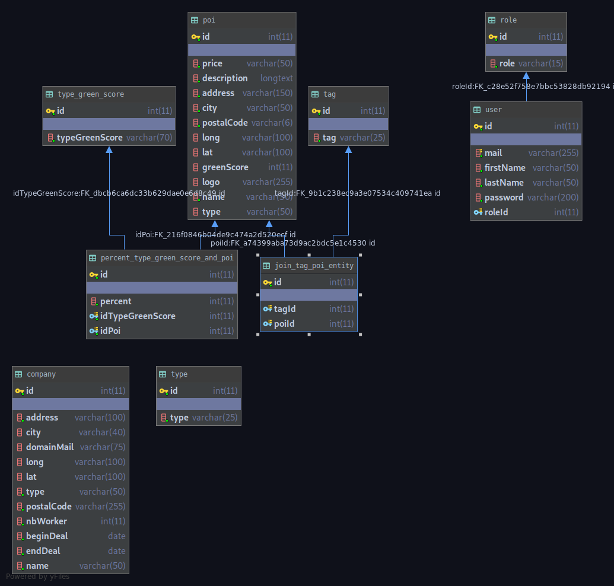

# MADU Back

## Description
    API REST du back office de madu
    
## Equipe
* [Clément Haller](https://github.com/Telmalk)
* [Guillaume Cornet](https://github.com/vinicel)

## Techno
* NestJS
* MySQL

## Documentation
* [Compodoc](http://localhost:8080)
* [Swagger](http://35.180.228.155:3000/api/)

## UML Base de donnée

