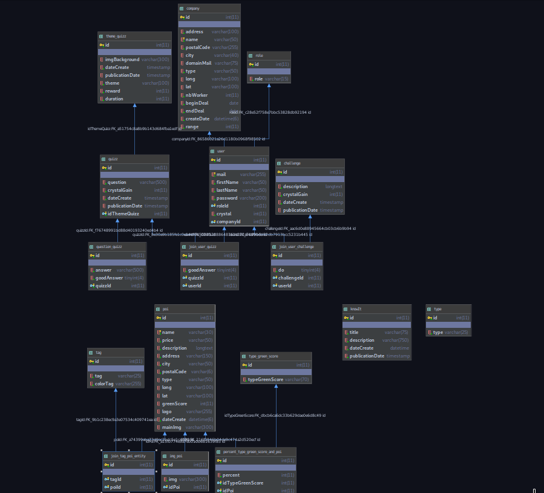

# MADU Back

## Description
    API REST du back office de madu
    
## Equipe
* [Clément Haller](https://github.com/Telmalk) (dev back api)
* [Guillaume Cornet](https://github.com/vinicel) (infra/server)

## Techno
* NestJS
* MySQL
* TypeOrm
* json web token pour l'authentification a l'api

## Documentation
* Compodoc(http://${URL}:8081)
* Swagger (http://${URL}:3000/documentation/)

## UML Base de donnée

## Commande
### lancer l'app en dev:
    - yarn install
    - docker-compose up
### Test
    - yarn test
    - yarn test:watch
    - yarn test:cov
    - yarn test:debug
    
## Lint
    - yarn lint
### Prod
    - yarn build
    - yarn start:prod

## Dependencies
*   @nestjs/common
*   @nestjs/core
*   @nestjs/jwt
*   @nestjs/passport
*   @nestjs/platform-express
*   @nestjs/swagger
*   @nestjs/typeorm
*   @types/bcrypt
*   @types/compression
*   @types/cookie-parser
*   bcrypt
*   class-transformer
*   class-validator
*   compression
*   cookie-parser
*   express-rate-limit
*   helmet
*   hex-to-rgba
*   moment
*   mysql
*   passport
*   passport-jwt
*   passport-local
*   reflect-metadata
*   rimraf
*   rxjs
*   swagger-ui-express
*   typeorm

### DevDependencies

*   @compodoc/compodoc
*   @nestjs/cli
*   @nestjs/schematics
*   @nestjs/testing
*   @types/express
*   @types/jest:
*   @types/node
*   @types/passport-jwt
*   @types/passport-local
*   @types/supertest
*   jest
*   prettier
*   supertest
*   ts-jest
*   ts-loader
*   ts-node
*   tsconfig-paths
*   tslint
*   typescrip
